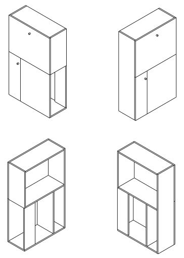

# PC-Schrank

Kleiner Schrank als platzsparende zuklappbare Alternative zum Schreibtisch.

In dem Fach oben wird der Bildschirm stehen. 

Auf der Klappe davor wird die Tastatur und Maus sein.

Unten rechts kommt der PC rein. 

Unten links ist Platz für ein paar DIN A4 Ordner.

## Benötigtes Material:

* 3-Schicht Holzplatte (Fichte) (2500mm x 1250mm x 19mm)
* Scharnier(e) für Klappe
* Scharniere für Türe
* Schrauben
* Holzschutz Lasur

## Kosten

folgt nach Fertigstellung
